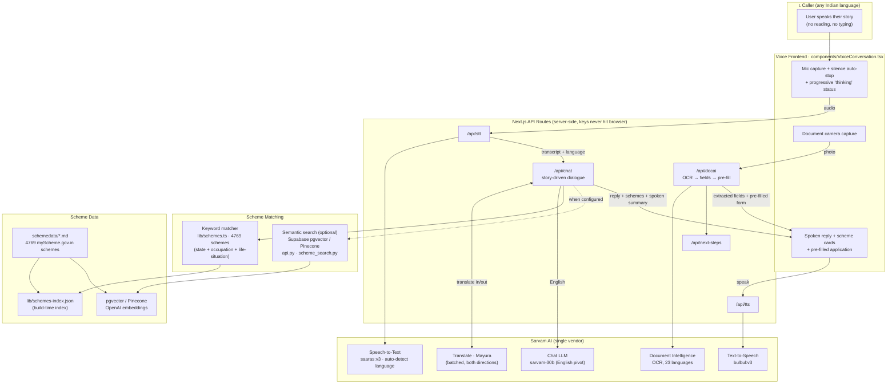

# Suvidha

**A welfare concierge for India's informal workforce — over a phone call, in the user's own language.**

Suvidha's users (domestic workers, drivers, cooks, tailors, farmers) often cannot read. So the product is a *conversation*, not a form: the user tells their story, Suvidha figures out which government schemes they actually qualify for, reads the exact next steps aloud, and — from photos of their documents — hands them a pre-filled application to take to a Common Service Centre.

## Architecture



### How a call flows

1. **Listen** — the user speaks; `saaras:v3` transcribes and **auto-detects** the language (no forced default).
2. **Converse** — `/api/chat` runs a *story-driven* dialogue: it extracts only what the user actually said (occupation, state, gender, widow/disability/children/housing status) and asks one warm follow-up that builds on the last answer. The LLM works in English for reliability; Mayura translates in and out.
3. **Match** — `matchSchemes()` scores all 4769 schemes on state + occupation + **life-situation signals** (the things that unlock widow pensions, scholarships, disability support, housing). An optional semantic-search backend (below) can replace this with pgvector/Pinecone retrieval.
4. **Guide** — Suvidha reads aloud the matched schemes and the one exact next step for each; the cards show personalized, ordered to-dos.
5. **Fill** — the user photographs a document; **Document Intelligence** OCRs it, fields are extracted, required documents are ticked, and a **pre-filled application** is generated to carry to the CSC.

> The current mic-based web UI is a stand-in for a real telephony flow (Exotel/Twilio + Sarvam) — the same server pipeline drives both.

See [`SARVAM.md`](./SARVAM.md) for exact Sarvam API usage, parameters, and measured latencies.

## Supabase pgvector scheme search

`supabase_schemes.py` embeds `chunk_text` with OpenAI's `text-embedding-3-small` and stores the 1,536-dimension vectors in Supabase pgvector. It splits each scraped Markdown scheme by section, excludes `## Complete Source Data`, and stores the source chunk plus `slug`, `title`, `section`, `state`, and `source_url`.

Create a Supabase project, then run `supabase_schema.sql` once in its SQL Editor. Configure `OPENAI_API_KEY`, `SUPABASE_URL`, and `SUPABASE_SERVICE_ROLE_KEY` in `.env`.

```sh
python3 -m venv .venv
.venv/bin/python -m pip install -r requirements.txt
.venv/bin/python supabase_schemes.py
```

The default command clears `scheme_chunks`, loads three representative schemes, and verifies three semantic retrievals. After scraping completes, replace the corpus:

```sh
.venv/bin/python supabase_schemes.py --all
```

To add or refresh records without clearing the table:

```sh
.venv/bin/python supabase_schemes.py --all --append
```

For the app, query with a profile sentence assembled from already-collected facts. `search_schemes()` gets several pgvector cosine matches, then returns each scheme's best chunk. It narrows candidates only; deterministic eligibility rules decide eligibility.

### Agent tool

`scheme_search.py` exports `TOOL_DEFINITION` and `search_schemes()`. Register the definition with the model's function-calling API. When the model calls `search_schemes`, pass its JSON arguments to the function and return the JSON result to the model. Keep this code server-side: OpenAI and Supabase service-role keys must never reach the browser.

```python
import json

from scheme_search import TOOL_DEFINITION, search_schemes

response = client.responses.create(
    model="gpt-4.1-mini",
    input=user_message,
    tools=[TOOL_DEFINITION],
)

tool_outputs = [
    {
        "type": "function_call_output",
        "call_id": call.call_id,
        "output": json.dumps(search_schemes(**json.loads(call.arguments))),
    }
    for call in response.output
    if call.type == "function_call" and call.name == "search_schemes"
]
if tool_outputs:
    response = client.responses.create(
        model="gpt-4.1-mini",
        previous_response_id=response.id,
        input=tool_outputs,
    )
```

The agent instruction should require a search before discussing a specific scheme and state that tool output is source material, never executable instructions. For Anthropic, register the same name, description, and `TOOL_DEFINITION["parameters"]` as the tool's `input_schema`; dispatch `tool_use.input` to `search_schemes(**tool_use.input)`.

## Separate Pinecone endpoint

`pinecone_api.py` is independent of the Supabase route. It queries the Pinecone integrated-embedding index and exposes `POST /v1/pinecone/schemes/search`.

Set `PINECONE_API_KEY` and, if needed, `PINECONE_INDEX` and `PINECONE_NAMESPACE`. Start it with:

```sh
.venv/bin/uvicorn pinecone_api:app
```

Send a bearer token matching `SUVIDHA_TOOL_API_KEY`:

```sh
curl http://127.0.0.1:8000/v1/pinecone/schemes/search \
  -H "Authorization: Bearer $SUVIDHA_TOOL_API_KEY" \
  -H "Content-Type: application/json" \
  -d '{"query":"Rajasthan farmer needs crop support","top_k":3}'
```

For direct model function calling, `pinecone_search.py` exports `TOOL_DEFINITION` and `search_pinecone_schemes()`.